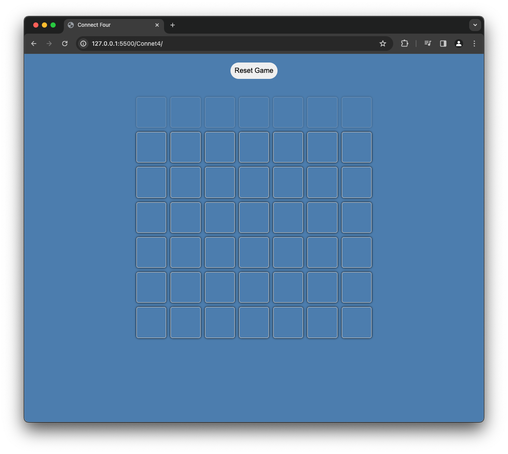

Our Connect 4 game, programmed in JavaScript, features an AI opponent for solo play. Players drop colored discs into a vertical grid to create lines of four discs horizontally, vertically, or diagonally. The game offers dynamic AI and responsive design.

HOW TO RUN 
------------------------------------
* To get started, navigate to the Connet4 repository on GitHub and download the files. Then, open the folder in Visual Studio Code and launch the live server extension. This action  will automatically open the project in your default web browser.

Click here to view live:
[Visit website](https://08milam.github.io/Connet4/)

TECHNOLOGY STACK USED
------------------------------------
* HTML
* CSS
* JavaScript
* Basic AI

